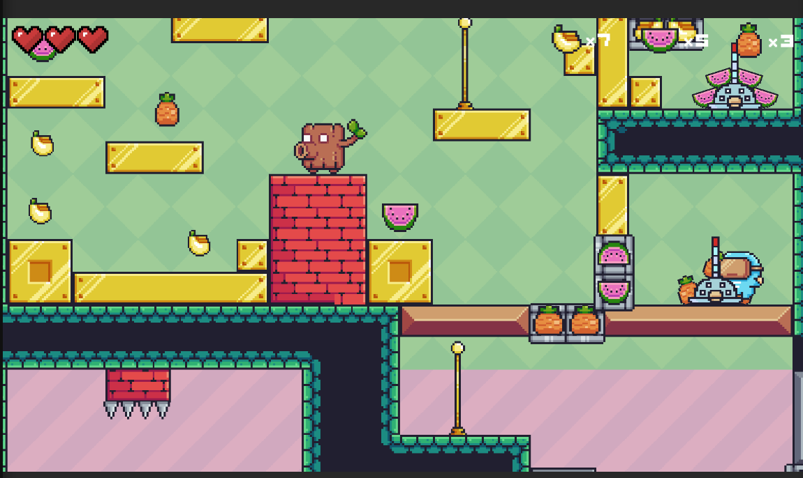

# 🐗 PIXEL_ADVENTURE  

**PIXEL_ADVENTURE** là một trò chơi **platformer 2D** được phát triển bằng **Unity**, nơi người chơi điều khiển nhân vật rừng rú dễ thương phiêu lưu qua các màn chơi đầy thử thách.  
Bạn sẽ phải **thu thập trái cây**, **né tránh chướng ngại vật**, **tiêu diệt kẻ thù** và tìm cách vượt qua từng bản đồ đầy màu sắc.  

---

## 📸 Screenshot  
  

---

## 🎮 Giới thiệu  

- **Thể loại:** Platformer / Adventure 2D  
- **Lấy cảm hứng từ:** Các trò chơi cổ điển như **Super Mario** và game pixel retro  
- **Đặc điểm:** Đồ họa pixel art sinh động, gameplay cổ điển nhưng lôi cuốn  
- **Trải nghiệm:** Kết hợp giữa phiêu lưu, hành động và thu thập vật phẩm  

---

## 🧑‍💻 Thông tin sinh viên thực hiện  

- **Họ tên:** Quách Thành Long  
- **Email:** longqt.124010124034@vtc.edu.vn  
- **Lớp học phần:** K24GD-03-2D Game Engine  
- **Giờ học:** 8h30 – 11h30  
- **Giảng viên hướng dẫn:** Thầy Nguyễn Trung Hiếu  

---

## 🚀 Tính năng nổi bật  

- 🎨 **Đồ họa pixel art đầy màu sắc** với phong cách retro  
- 🕹️ **Điều khiển dễ hiểu** (di chuyển, nhảy, tấn công)  
- 🍌 **Thu thập vật phẩm** (chuối, dưa hấu, cà rốt,...) để tăng điểm  
- ⚔️ **Kẻ thù đa dạng** và **cơ chế bẫy nguy hiểm**  
- 🔊 **Âm nhạc & hiệu ứng âm thanh vui nhộn**  
- 📈 **Cấp độ thử thách**, càng đi sâu càng khó  

---

## 🛠️ Công nghệ sử dụng  

- **Game Engine:** Unity 2D  
- **Ngôn ngữ:** C#  
- **Thiết kế đồ họa:** Sprite Editor / Aseprite  
- **Quản lý mã nguồn:** GitHub  

---

## 📦 Cài đặt & chạy game  

```bash
# Clone repo
git clone https://github.com/StephenSouth13/Pixel-Adventure-Unity.git

# Mở project trong Unity Hub và bấm Play để chạy game
